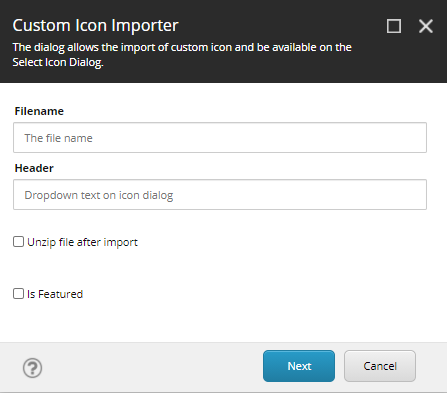

# Icon Importer

The Icon Importer is a Sitecore module that allows icons to be imported to the CMS.

## Features

1. Import icons to CMS.
2. Update existing custom icons.
3. Remove custom icons.
4. Display imported icons in the Icon Selection Dialog.
5. Set icons as featured.

## Installation

All you need to do is install the icon importer provided in the folder **Releases**. Note that this is a Sitecore Package.

1. Navigate to the Sitecore Desktop.
2. Open the Installation Wizard.
3. Upload Package.
4. Proceed with installation.

# HOW-TO

## Import Custom Icons

On Sitecore ribbon, under the Configure Tab, click on the Custom Icon down arrow and select **Import**. Fill in the different input. Note for the Filename entry, it should match the file name you are uploading without the extension.

## Update Custom Icons

When you select the update custom icon, you specify the name of the file to be uploaded. Then it will overwrite the existing package.

## Remove Custom Icons

When you select the remove custom icon, you just select what custom icon you want to remove and then it will cleanup the directories and IconCache where the custom icons are present.

